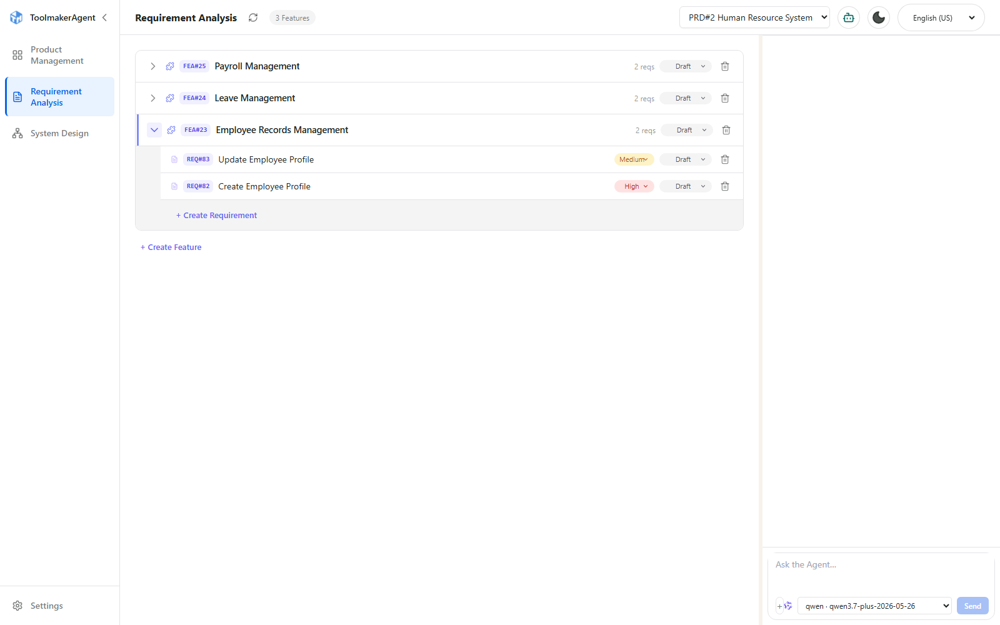
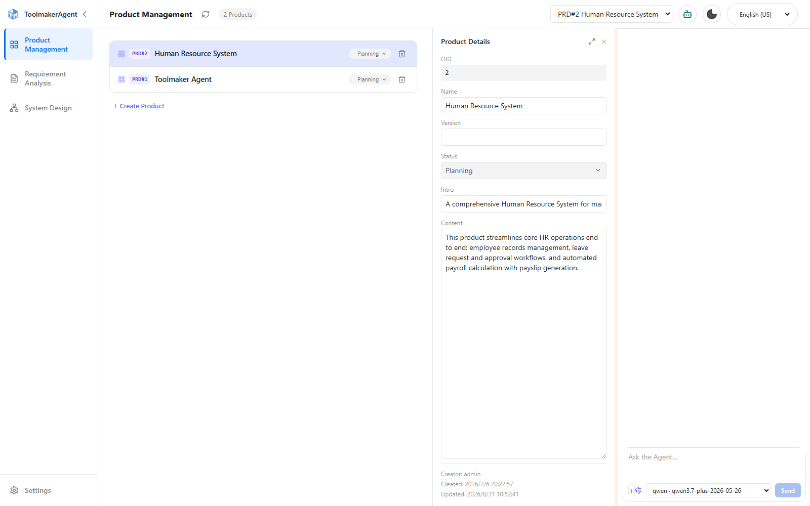
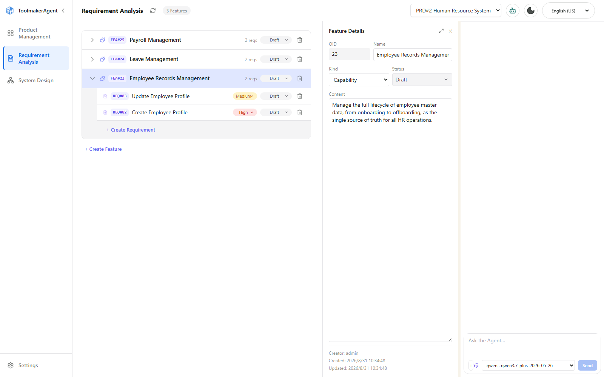
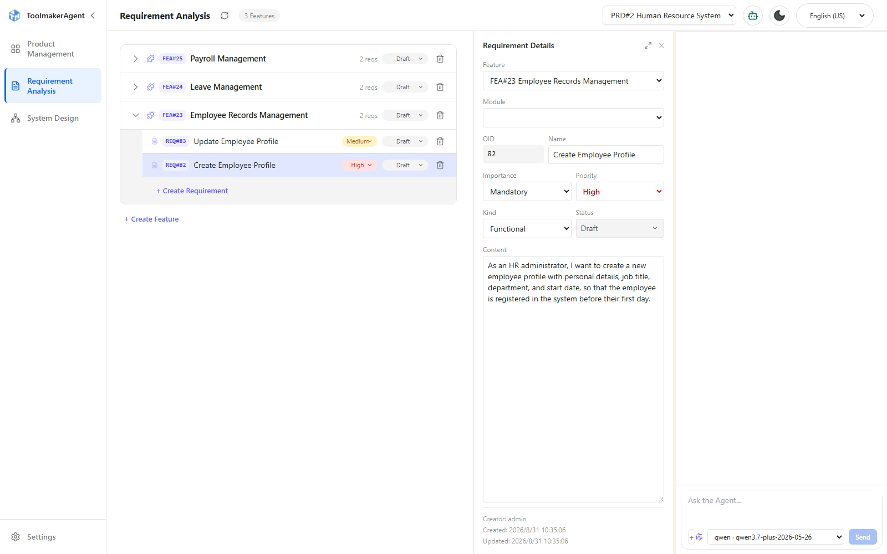
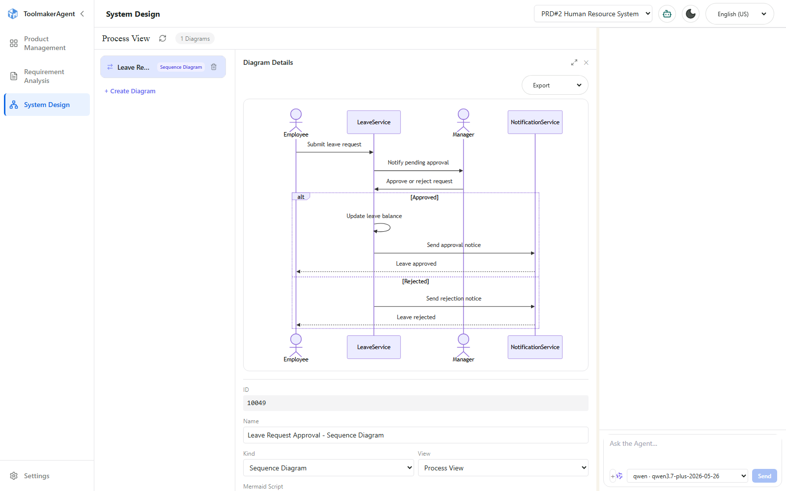
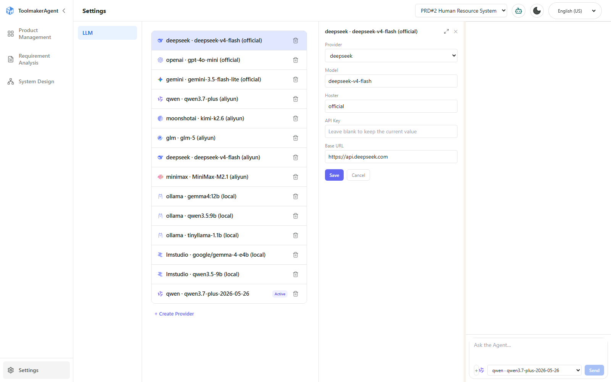
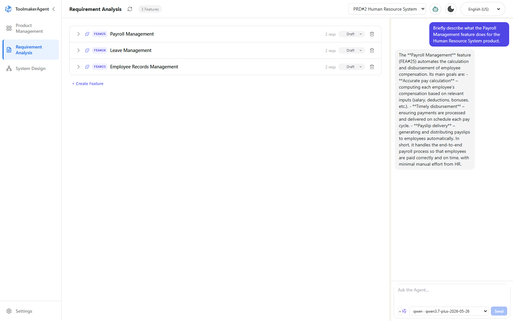
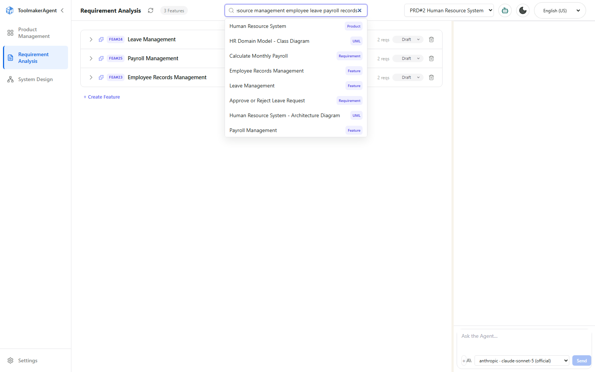

# Toolmaker Agent

<p align="center"><strong><em>We don't care what you build, We care how you build it.</em></strong></p>

An AI-augmented requirements and system-design workbench: a Go backend with an embedded React UI for managing **Products, Features, Requirements, and UML/4+1-view system-design diagrams**, paired with an LLM-driven conversational agent and a Model Context Protocol (MCP) server so both humans and coding agents (e.g. Claude Code) can drive the same data model.

<!-- SCREENSHOT: main workbench overview, e.g. the Requirements page with the
     product/feature tree, detail panel, and chat panel all visible -->


## What this is

Toolmaker Agent is a single self-contained executable: a Go REST API with a layered architecture (adapter → service → infra/dao → domain/model), SQLite storage, and the compiled React frontend embedded directly into the binary via `go:embed`. Open one port and you get the full workbench — no separate frontend deployment, no external database to provision.

On top of the plain CRUD workbench, it adds three AI-native ways to work with the same data:

- **Conversational agent** — a chat panel backed by [`trpc-agent-go`](https://github.com/trpc-group/trpc-agent-go) that can create/update/delete Products, Features, Requirements, and UML diagrams through natural language, using a **propose → confirm** flow for any write (the model proposes the action, a human confirms it before it executes).
- **MCP Server** — a [Model Context Protocol](https://modelcontextprotocol.io/) endpoint (official [`modelcontextprotocol/go-sdk`](https://github.com/modelcontextprotocol/go-sdk)) exposing 20 tools for full CRUD over the same four entities, so a coding agent like Claude Code can manage requirements directly from the terminal. Unlike the chat's propose/confirm tools, MCP tools are **direct tools** — they execute immediately, with no confirmation step.
- **RAG / semantic search** — every Product/Feature/Requirement/UML is embedded and indexed as it's written, so the chat agent, MCP clients, and a REST endpoint can all find entities by *meaning* ("find requirements similar to X"), not just exact keyword/OID matches.

## Key features

- **Product / Feature / Requirement / UML CRUD**, each with optimistic concurrency (a `revision` field, checked on every update) and full-row responses on create/update (the backend `RETURNING`s the complete post-write row so the client never has to guess at server-computed fields like `updatedAt` or `revision`).

  <!-- SCREENSHOT: Product Management page, a product selected with its detail panel open -->
  

  <!-- SCREENSHOT: Requirement Analysis page with a Feature selected, showing the Feature detail panel -->
  

  <!-- SCREENSHOT: Requirement Analysis page with a Requirement selected, showing the Requirement detail panel -->
  

- **4+1 system-design views** rendered as [Mermaid](https://mermaid.js.org/) diagrams (flowcharts, sequence, C4/architecture, state, ER, and more), editable per Feature. Any diagram can be exported client-side as a **PNG or SVG** image (PNG rasterized at 3x scale for sharp output) directly from its detail panel — no server round trip.

  <!-- SCREENSHOT: system-design page showing a rendered Mermaid sequence diagram -->
  

- **LLM chat agent** with:
  - A propose-confirm tool-calling flow for every write (`propose_create_*` / `propose_update_*` / `propose_delete_*`), so the model never mutates data without a human in the loop.
  - SSE-streamed responses.
  - Persisted, per-conversation history, automatically **summarized** once it grows past a threshold (rolling summary folds everything except the most recent turns, keeping long sessions within the model's context window).
  - Pluggable multi-provider configuration — OpenAI, Anthropic, Gemini, DeepSeek, Ollama, LM Studio, Hunyuan, Moonshot AI, Qwen, GLM, MiniMax. Managed either by hand-editing a local, git-ignored `config/settings.json` (never committed; a documented `.example` template is checked in instead), or entirely from the browser via the **Settings** page, which lists every configured provider and lets you add, edit, activate, or delete one without touching a file.

  <!-- SCREENSHOT: Settings page, LLM section, provider list with one entry's detail panel open -->
  

  <!-- SCREENSHOT: chat panel mid-conversation, ideally showing a
       propose/confirm dialog for a write action (e.g. "propose_update_requirement") -->
  
- **MCP Server** — 20 tools (5 each for Product/Feature/Requirement/UML: create/query/query-list/update/delete), Streamable HTTP transport, so any MCP-aware client can query or edit the requirements model directly.
- **RAG / semantic search** — a global search box in the header (searches every product in the org by default) plus a `semantic_search` tool available from both the chat agent and MCP clients. Built on [`trpc-agent-go`](https://github.com/trpc-group/trpc-agent-go)'s `knowledge/embedder` + `knowledge/vectorstore/inmemory` packages: an in-process vector index, no external vector database to run. Every Create/Update asynchronously (re-)embeds the entity's content — skipped automatically when the content hasn't actually changed — and a SQLite-backed `embedding_cache` table persists every vector so the in-memory index rebuilds instantly on restart without re-calling the embedding API.

  <!-- SCREENSHOT: header search box open with a few results showing, kind badges visible -->
  

- **Embedded single-binary deployment** — the compiled frontend is staged into `web/dist` and embedded into the Go binary; the result is one executable that serves both the API and the UI.

## Tech stack

| Layer | Technology |
|---|---|
| Backend language/runtime | Go 1.26 |
| HTTP framework | [Gin](https://github.com/gin-gonic/gin) |
| Database | SQLite via [`dbsqlx`](https://github.com/vinovest/sqlx) (raw SQL, no ORM); schema applied from `config/schema_sqlite.sql` |
| Agent/LLM orchestration | [`trpc-agent-go`](https://github.com/trpc-group/trpc-agent-go) |
| RAG / vector search | `trpc-agent-go`'s `knowledge/embedder` (OpenAI-compatible embeddings, incl. DashScope) + `knowledge/vectorstore/inmemory` |
| MCP | Official [`modelcontextprotocol/go-sdk`](https://github.com/modelcontextprotocol/go-sdk), Streamable HTTP transport |
| Auth/policy | Casbin (via `common-library-golang/auth`) |
| CLI | [Cobra](https://github.com/spf13/cobra) |
| Frontend | React 19, TypeScript, Vite |
| Frontend state | [TanStack Query](https://tanstack.com/query) v5 |
| Frontend routing | react-router-dom v7 |
| Styling | Tailwind CSS |
| Diagrams | [Mermaid](https://mermaid.js.org/) (+ Cytoscape, KaTeX for advanced diagram types) |

## MCP Server

Register the server with an MCP-aware client (e.g. Claude Code):

```
claude mcp add --transport http toolmaker-agent http://127.0.0.1:8080/agtapi/v2/mcp
```

20 tools are exposed, 5 for each of Product / Feature / Requirement / UML:

| Operation | Product | Feature | Requirement | UML |
|---|---|---|---|---|
| Create | `create_product` | `create_feature` | `create_requirement` | `create_uml` |
| Get one | `query_product` | `query_feature` | `query_requirement` | `query_uml` |
| List | `query_product_list` | `query_feature_list` | `query_requirement_list` | `query_uml_list` |
| Update | `update_product` | `update_feature` | `update_requirement` | `update_uml` |
| Delete | `delete_product` | `delete_feature` | `delete_requirement` | `delete_uml` |

Entities are addressed by a stable, per-parent `OID` (not the internal database `id`), and Requirement/Feature/UML lookups take a `productOid` (Requirement additionally accepts an optional `featureOid`). MCP tools execute immediately against live data — there is no propose/confirm step here (that's specific to the web chat's tool-calling flow).

A 21st tool, `semantic_search`, is also exposed (requires `productOid`; searches that product's Features/Requirements/UML/itself by meaning) — see below.

## Semantic Search

Three ways to reach the same underlying vector index, each scoped differently:

| Surface | Scope | Notes |
|---|---|---|
| Chat agent tool (`semantic_search`) | The chat's current product only | Real-execution tool, like `query_requirement_list` — the model can't pick a different product itself |
| MCP tool (`semantic_search`) | One product, via required `productOid` | Same handler logic as the chat tool |
| `GET /agtapi/v2/search?q=...` | **Every product in the org** by default; optional `productOid` narrows to one | Backs the header search box; results include `productOid` since a hit can come from any product |

All three return each hit's kind (`product`/`feature`/`requirement`/`uml`), OID (or internal id for `uml`, which has none), name, and a relevance score — never the full content; follow up with the matching `query_*`/`get`/detail-panel lookup once you know which entity matched.

**Rebuilding the index**: `POST /agtapi/v2/admin/rag/reindex?productOid=<optional>&force=<optional>` walks every Product (or one, via `productOid`) and re-submits every entity under it for indexing. Use it to backfill data that existed before semantic search was configured, or — with `force=true` — to force a full re-embed after switching embedding models (the normal skip-unchanged-content check has no way to detect a model change on its own). Mounted the same way as the other no-auth-middleware admin routes (`adapter/admin_restful_api.go`) — trusted-network only, not for internet-facing deployments.

## License

Apache License 2.0 — see [LICENSE](./LICENSE).
